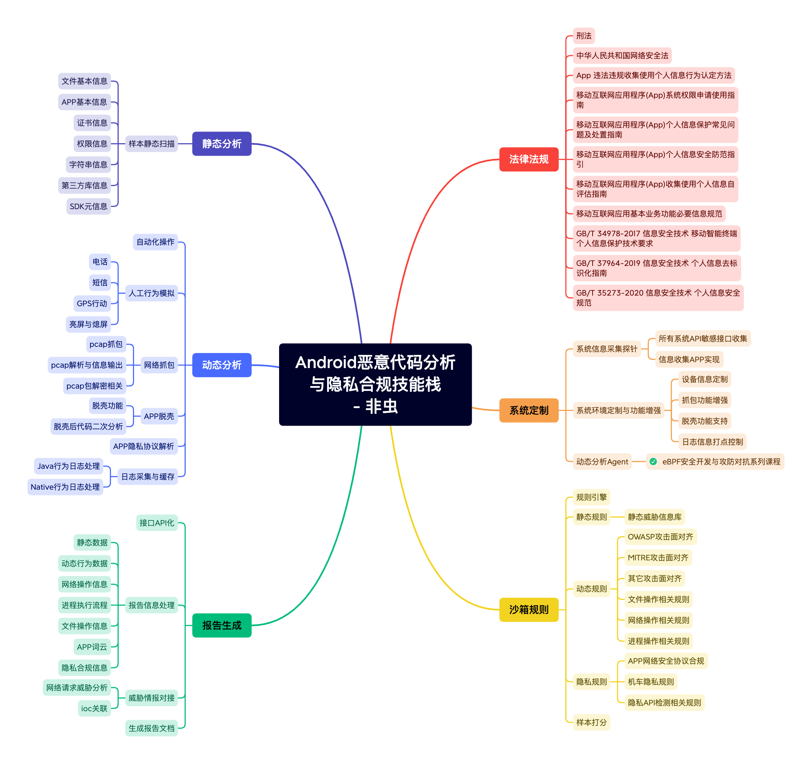
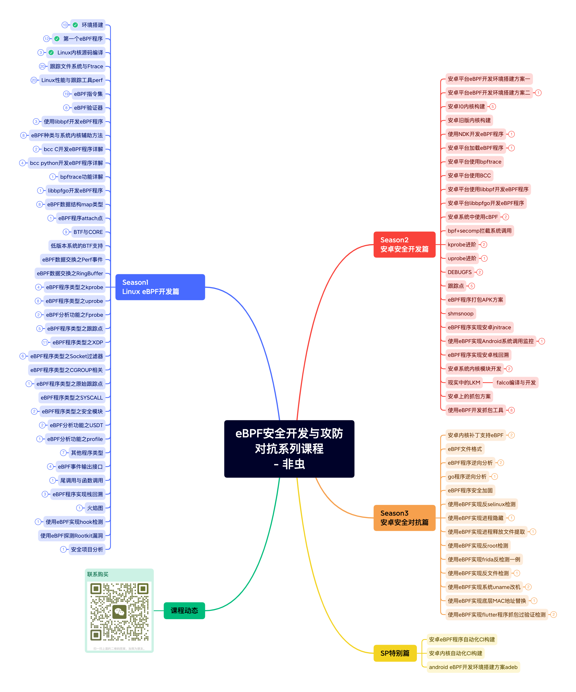

# eBPF安全开发与攻防对抗系列课程

## Android恶意代码分析与隐私合规技能栈

这个技术栈宇宙目前正在完善**eBPF安全开发与攻防对抗系列课程**

## eBPF特性与课程索引对应表

eBPF的课程目录是尽可能全面的探索eBPF功能与特性。包含不限于：

1. eBPF功能特性
2. eBPF MAP数据结构
3. eBPF内核helpers方法的使用
4. eBPF的程序类型

[eBPF特性与课程索引对应表](./eBPF特性与课程索引对应表.md)

## 目录

BPF安全开发与攻防对抗系列初版目录如下图

## 试看

[环境搭建](https://mp.weixin.qq.com/s/wGAwcg8VnB4PLREzdNPWng)

关注微信公众号

